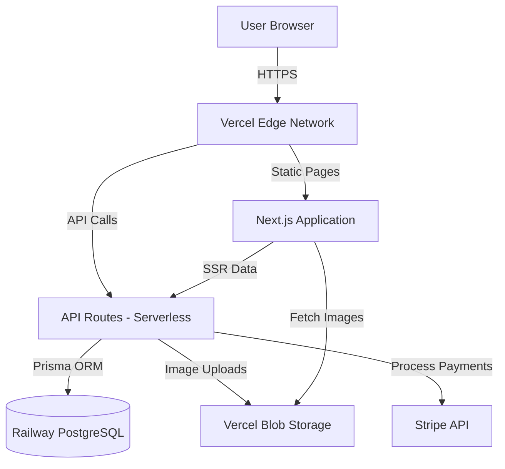

# 4050 Simplified Architecture Document

**Version:** 2.0 (Simplified)  
**Date:** November 28, 2025  
**Status:** Ready for Development  
**Project:** 4050 Simple Produce Marketplace

---

## Introduction

This document outlines the simplified fullstack architecture for 4050, focused on getting a working product to market quickly with minimal complexity.

### Change Log

| Date | Version | Description | Author |
|------|---------|-------------|--------|
| 2025-11-28 | 2.0 | Simplified architecture - removed EasyPost, Resend, complex monitoring | Mary (Analyst) |

---

## High Level Architecture

### Technical Summary

4050 uses **Next.js 14+ (App Router)** deployed to Vercel, with **PostgreSQL + Prisma** for data, **Stripe** for payments, and **Vercel Blob** for image storage. The architecture prioritizes simplicity: no real-time shipping calculations (tiered pricing), no email service (thank you page only), basic monitoring (Vercel Analytics only). Perfect for a small-scale operation with minimal operational overhead.

### Platform and Infrastructure

**Platform:** Vercel  
**Key Services:**
- **Compute:** Vercel Edge Network (serverless Next.js API routes)
- **Database:** Railway PostgreSQL (free tier)
- **Storage:** Vercel Blob (product images)
- **Payments:** Stripe (pay per transaction)
- **Monitoring:** Vercel Analytics (basic metrics)

**Rationale:** Minimal services = lower costs, simpler maintenance, faster development.

### Architecture Diagram



---

## Tech Stack

| Category | Technology | Purpose |
|----------|-----------|---------|
| Frontend | Next.js 14+ (App Router) | Full-stack React framework |
| Language | TypeScript | Type safety |
| Styling | Tailwind CSS | Utility-first styling |
| Database | PostgreSQL | Data storage |
| ORM | Prisma | Type-safe database access |
| Storage | Vercel Blob | Product images |
| Payments | Stripe | Payment processing |
| Auth | NextAuth.js | Admin authentication |
| State | React Context + localStorage | Cart state |

---

## Data Models

### Product

```typescript
interface Product {
  id: string;
  name: string;
  description: string;
  price: number; // in cents (e.g., 999 = $9.99)
  imageUrl: string; // Vercel Blob URL
  isAvailable: boolean;
  createdAt: Date;
  updatedAt: Date;
}
```

**Prisma Schema:**
```prisma
model Product {
  id          String   @id @default(uuid())
  name        String
  description String   @db.Text
  price       Int      // Price in cents
  imageUrl    String
  isAvailable Boolean  @default(true)
  createdAt   DateTime @default(now())
  updatedAt   DateTime @updatedAt
  
  orderItems OrderItem[]
  
  @@index([isAvailable])
  @@map("products")
}
```

### Order

```typescript
interface Order {
  id: string;
  customerName: string;
  customerEmail: string;
  customerPhone: string;
  shippingAddress: ShippingAddress | null;
  fulfillmentMethod: "SHIPPING" | "PICKUP";
  shippingCost: number | null; // in cents (calculated by tier)
  subtotal: number; // in cents
  total: number; // in cents
  paymentStatus: "PENDING" | "PAID" | "FAILED";
  fulfillmentStatus: "PENDING" | "FULFILLED";
  stripePaymentIntentId: string | null;
  createdAt: Date;
  items: OrderItem[];
}
```

**Prisma Schema:**
```prisma
model Order {
  id                    String            @id @default(uuid())
  customerName          String
  customerEmail         String
  customerPhone         String
  shippingAddress       Json?             // { street, city, state, zipCode }
  fulfillmentMethod     FulfillmentMethod
  shippingCost          Int?              // In cents (tiered calculation)
  subtotal              Int               // In cents
  total                 Int               // In cents
  paymentStatus         PaymentStatus     @default(PENDING)
  fulfillmentStatus     FulfillmentStatus @default(PENDING)
  stripePaymentIntentId String?           @unique
  createdAt             DateTime          @default(now())
  updatedAt             DateTime          @updatedAt
  
  items OrderItem[]
  
  @@index([fulfillmentStatus])
  @@index([createdAt])
  @@map("orders")
}
```

### OrderItem

```typescript
interface OrderItem {
  id: string;
  orderId: string;
  productId: string;
  productName: string; // Snapshot
  quantity: number;
  unitPrice: number; // in cents (snapshot)
  lineTotal: number; // in cents
}
```

### User (Admin)

```typescript
interface User {
  id: string;
  email: string;
  passwordHash: string;
  name: string;
  createdAt: Date;
  updatedAt: Date;
}
```

---

## API Routes

### Public Routes

- `GET /api/products` - List available products
- `POST /api/checkout` - Create order and payment intent

### Admin Routes (Protected)

- `POST /api/admin/products` - Create product (with image upload)
- `PUT /api/admin/products/[id]` - Update product (with image upload)
- `DELETE /api/admin/products/[id]` - Delete product
- `GET /api/admin/orders` - List orders (customer name, email, items, fulfillment method)
- `PATCH /api/admin/orders/[id]` - Mark order as fulfilled

---

## Shipping Calculation

Simple tiered pricing based on order size:

```typescript
function calculateShipping(subtotal: number, fulfillmentMethod: string): number {
  if (fulfillmentMethod === "PICKUP") {
    return 0;
  }
  
  // Tiered pricing based on order size
  if (subtotal < 5000) { // Under $50
    return 800; // $8.00
  } else {
    return 1200; // $12.00
  }
}
```

Location-based adjustments can be added later if needed.

---

## Frontend Pages

### Public Pages
- `/` - Homepage
- `/shop` - Product catalog (click image for details modal/page)
- `/cart` - Shopping cart
- `/checkout` - Checkout form (shows pickup details when selected)
- `/thank-you` - Order confirmation
- `/about` - About page (includes pickup location/hours)

### Admin Pages
- `/admin/login` - Admin login
- `/admin/products` - Product list and management
- `/admin/orders` - Order list (customer name, email, items, fulfillment method)

---

## Key Components

### Product Catalog
- Product grid with images, names, prices
- Click image to show product details (modal or detail page)
- Add to cart functionality

### Shopping Cart
- List of items with quantities
- Update/remove items
- Subtotal calculation

### Checkout
- Customer info form
- Fulfillment method selector (Pickup/Shipping)
- Shipping address (if shipping selected)
- Pickup details display (if pickup selected)
- Stripe payment integration
- Shipping cost calculation (tiered)

### Admin Product Management
- Product list
- Add/edit form with image upload
- Available/not available toggle

### Admin Orders
- Order list showing: customer name, email, items, fulfillment method
- Mark as fulfilled action

---

## Image Upload Flow

1. Admin selects image file in product form
2. Frontend sends file to `/api/admin/products` (or separate upload endpoint)
3. API route uploads to Vercel Blob
4. Returns image URL
5. Save URL to database

```typescript
// Example: Upload to Vercel Blob
import { put } from '@vercel/blob';

const blob = await put(file.name, file, {
  access: 'public',
});

// blob.url is the public URL to save in database
```

---

## Authentication

NextAuth.js with credentials provider for admin login:

```typescript
// Simple email/password authentication
// Session stored in JWT cookie
// Protected routes check session
```

---

## Database Schema (Prisma)

```prisma
generator client {
  provider = "prisma-client-js"
}

datasource db {
  provider = "postgresql"
  url      = env("DATABASE_URL")
}

model User {
  id           String   @id @default(uuid())
  email        String   @unique
  passwordHash String
  name         String
  createdAt    DateTime @default(now())
  updatedAt    DateTime @updatedAt
  @@map("users")
}

model Product {
  id          String   @id @default(uuid())
  name        String
  description String   @db.Text
  price       Int      // Price in cents
  imageUrl    String
  isAvailable Boolean  @default(true)
  createdAt   DateTime @default(now())
  updatedAt   DateTime @updatedAt
  
  orderItems OrderItem[]
  
  @@index([isAvailable])
  @@map("products")
}

enum FulfillmentMethod {
  SHIPPING
  PICKUP
}

enum PaymentStatus {
  PENDING
  PAID
  FAILED
}

enum FulfillmentStatus {
  PENDING
  FULFILLED
}

model Order {
  id                    String            @id @default(uuid())
  customerName          String
  customerEmail         String
  customerPhone         String
  shippingAddress       Json?
  fulfillmentMethod     FulfillmentMethod
  shippingCost          Int?
  subtotal              Int
  total                 Int
  paymentStatus         PaymentStatus     @default(PENDING)
  fulfillmentStatus     FulfillmentStatus @default(PENDING)
  stripePaymentIntentId String?           @unique
  createdAt             DateTime          @default(now())
  updatedAt             DateTime          @updatedAt
  
  items OrderItem[]
  
  @@index([fulfillmentStatus])
  @@index([createdAt])
  @@map("orders")
}

model OrderItem {
  id          String @id @default(uuid())
  orderId     String
  productId   String
  productName String
  quantity    Int
  unitPrice   Int
  lineTotal   Int
  
  order   Order   @relation(fields: [orderId], references: [id], onDelete: Cascade)
  product Product @relation(fields: [productId], references: [id], onDelete: Restrict)
  
  @@index([orderId])
  @@map("order_items")
}
```

---

## Project Structure

```
/app
├── layout.tsx              # Root layout
├── page.tsx                # Homepage
├── shop/
│   └── page.tsx            # Product catalog
├── cart/
│   └── page.tsx            # Shopping cart
├── checkout/
│   └── page.tsx            # Checkout
├── thank-you/
│   └── page.tsx            # Order confirmation
├── about/
│   └── page.tsx            # About page
└── admin/
    ├── login/
    │   └── page.tsx
    ├── products/
    │   └── page.tsx
    └── orders/
        └── page.tsx

/app/api
├── products/
│   └── route.ts            # GET /api/products
├── checkout/
│   └── route.ts            # POST /api/checkout
└── admin/
    ├── products/
    │   └── route.ts        # POST, PUT, DELETE
    └── orders/
        └── route.ts        # GET, PATCH

/components
├── products/
│   ├── ProductCard.tsx
│   └── ProductDetail.tsx  # Modal or page
├── cart/
│   └── CartItem.tsx
├── checkout/
│   └── CheckoutForm.tsx
└── admin/
    ├── ProductForm.tsx
    └── OrderList.tsx

/lib
├── types.ts                # Shared TypeScript types
├── format.ts               # Currency formatting
├── shipping.ts             # Shipping calculation
└── server/
    ├── db.ts               # Prisma client
    ├── auth.ts             # NextAuth config
    └── stripe.ts           # Stripe client
```

---

## Key Workflows

### Customer Purchase Flow

1. Browse `/shop` → See products
2. Click product image → See details
3. Add to cart → Cart updated
4. View `/cart` → Review items
5. Click checkout → `/checkout`
6. Fill form → Select pickup/shipping
7. Enter payment → Stripe processes
8. Success → `/thank-you` page

### Admin Product Management

1. Login → `/admin/login`
2. Navigate to `/admin/products`
3. Click "Add Product" or "Edit"
4. Fill form → Upload image
5. Save → Product created/updated

### Admin Order Fulfillment

1. Login → Navigate to `/admin/orders`
2. View order list (name, email, items, fulfillment method)
3. Mark as fulfilled → Status updated

---

## Environment Variables

```bash
# Database
DATABASE_URL=postgresql://...

# NextAuth
NEXTAUTH_URL=http://localhost:3000
NEXTAUTH_SECRET=...

# Stripe
STRIPE_SECRET_KEY=sk_...
NEXT_PUBLIC_STRIPE_PUBLISHABLE_KEY=pk_...

# Vercel Blob
BLOB_READ_WRITE_TOKEN=vercel_blob_...
```

---

## Deployment

- **Frontend/Backend:** Vercel (automatic deployment from Git)
- **Database:** Railway PostgreSQL
- **Storage:** Vercel Blob
- **Migrations:** Run `prisma migrate deploy` on deployment

---

## What We Removed (Simplifications)

❌ **Removed:**
- EasyPost (real-time shipping) → Simple tiered calculation
- Resend (email service) → Thank you page only
- Sentry (complex error tracking) → Vercel Analytics only
- Complex inventory tracking → Simple available/not available
- Ingredients field → Not needed
- Product detail pages → Modal or simple page
- Order detail pages → List view only
- Complex error handling → Basic error messages

✅ **Kept:**
- Core shopping flow
- Stripe payments
- Basic admin
- Image uploads
- Simple shipping calculation

---

*This simplified architecture focuses on getting a working product to market quickly. We can add complexity later if needed.*

